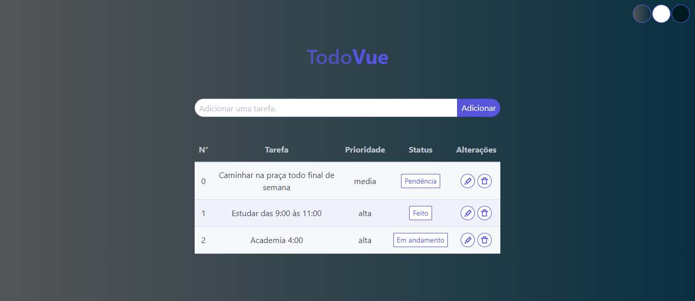
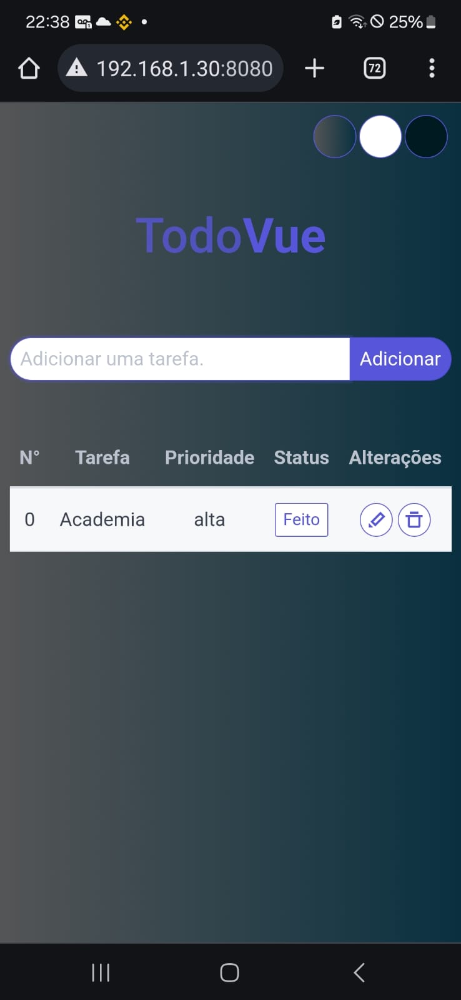

## TodoVue
- Aplicativo Frontend desenvolvido em Vue.js onde permite que o usuário crie, visualize, edite e exclua as tarefas do seu dia a dia
- Destinado ao estudo do Vue.js

## Situação
- Desenvolvimento 10/05/2024
- Finalizado 13/05/2024

## Template Principal

## Mobile (Responsivo)

## Contato:
| Integrante | Usuário Git | E-mail para contato |
| --- | --- | --- |
| Leandro Lobo | [@LeandroLobo](https://github.com/bigolho16) | bigolho900@gmail.com |
